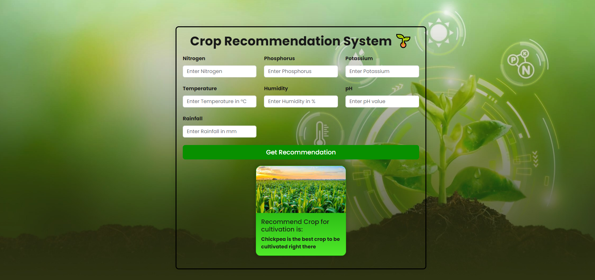

# Crop Recommendation System

## Description

To Find the Crop in That Condition
This Crop Recommendation Project is made by my College Dayalbagh Educational Institute, Agra


## Getting Started

### Dependencies

* Pandas
* Sciket-Learn
* Flask
* Numpy
* Pickle

### Installing

* How/where to download your program
* Any modifications needed to be made to files/folders

### Executing program

* How to run the program
```
python -m flask --app app run
```

## Authors
- Sahil Sadan
- Tarun Bansal

## Version History
* 1.0
    * Initial Release